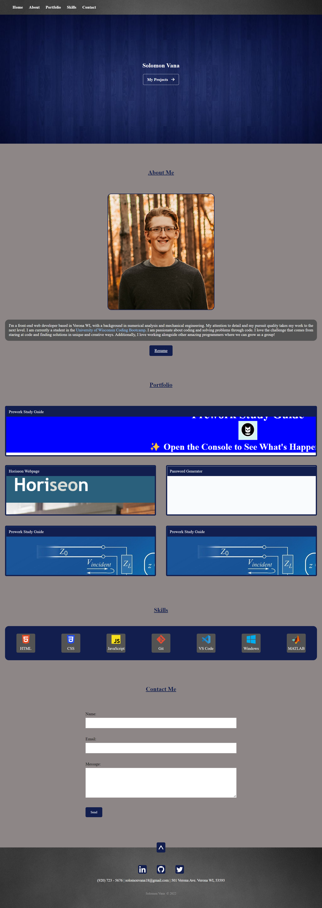

# solomonCodingPortfolio

## Description

This portfolio was created with the intent of creating a quality networking tool that shows off my skill and experience as a coder. This portfolio will help me better showcase my work and abilities. This portfolio allowed me to better learn CSS and HTML. Additionally, it taught me how different to better order semantic elements and how to include responsive components in my code.

## Screenshot

## Portfolio

[Link to Solomon's portfolio](https://solomon-coding.github.io/portfolio/)

## Credits

Modeled some aspects off of portfolio by Matthew Williams http://findmatthew.com/

## License

None.

